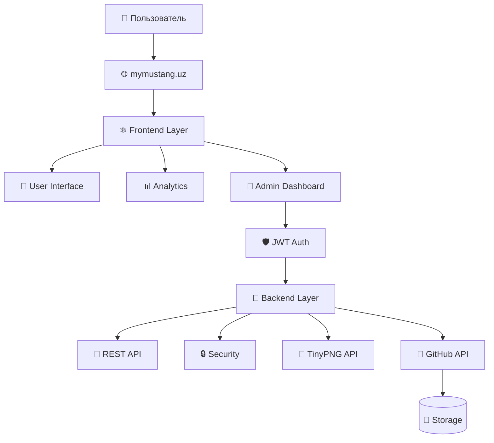

# My Mustang 🛵

> Экосистема премиальной платформы по аренде современного люксового транспорта в Ташкенте

 <h3>🚀 Технологический стек & функции</h3>

<p align="left">
  
  
  
  
  
</p>

<h3>⚡ Особенности</h3>

<p align="left">
  
  
  
  
  
</p>

<p align="left">
  
  
  
  
</p>

<h3>📊 Аналитика & безопасность</h3>

<p align="left">
  
  
  
  
  
</p>


---

### 🗺 Архитектура системы & Основные конвейеры обработки данных


```
### 📂 Структура каталогов проекта

```bash
.
├── ads.txt                 # Конфигурация авторизованных продавцов Google AdSense
├── api/                    # Маршруты бессерверного (Serverless) выполнения
│   └── telegram.js         # Транзакционный обработчик для Telegram-бота
├── backend/                # Ядро бизнес-логики приложения
│   ├── app.py              # Микросервисный движок маршрутизации на Flask
│   ├── data/               # Внутренние защищенные наборы данных и скрытые примитивы
│   ├── requirements.txt    # Зависимости среды выполнения Python
│   └── venv/               # Изолированный виртуальный слой среды Python
├── CHANGELOG.md            # Журнал инкрементных версий проекта
├── DOMAIN.md               # Параметры маршрутизации Edge Anycast и TLS 1.3
├── eslint.config.js        # Матрица правил проверки скриптов (linter)
├── EULA.md                 # Лицензионное соглашение с конечным пользователем
├── FUNDING.yml             # Платформы спонсорства проектов с открытым исходным кодом
├── GOOGLE_COMPLIANCE.md    # Таблица целевых показателей Core Web Vitals в реальном времени
├── index.html              # Корневой целевой файл выполнения DOM
├── LICENSE                 # Основная лицензия MIT и корпоративные аудиторские дополнения
├── package.json            # Метаданные пакета рабочей среды Node
├── package-lock.json       # Зафиксированное дерево состояний зависимостей пакетов
├── public/                 # Корневой каталог веб-ресурсов глобального доступа
│   ├── manifest.json       # Структурные параметры веб-приложения PWA
│   ├── mustang-pro-wb-shartnoma.docx # Оформленный юридический документ коммерческого клиента
│   ├── robots.txt          # Фильтры изоляции поисковых роботов
│   └── sitemap.xml         # Индекс реестра автоматического сканирования (карта сайта)
├── README.md               # Главный обзорный профиль инженерной документации
├── SECURITY.md             # Метрики безопасного раскрытия информации и цели Bug Bounty
├── src/                    # Рабочая область фронтенд-интерфейса
│   ├── admin/              # Модули логики панели управления и корни путей переменных
│   ├── App.css             # Центральная таблица стилей рабочей области
│   ├── App.jsx             # Главный структурный элемент-обертка
│   ├── assets/             # Локальный макет презентационной графики
│   ├── components/         # Переиспользуемые интерфейсные примитивы
│   ├── i18n/               # Индексные системы локализованных переводов
│   ├── index.css           # Свойства нормализации структурного макета
│   ├── main.jsx            # Вектор выполнения инициализации DOM
│   ├── pages/              # Целевые компоненты отображения рабочей области
│   ├── Router/             # Сопоставление переключателей состояний отображения
│   └── services/           # Конвейеры транзакций API и интеграции с TinyPNG
├── vercel.json             # Глобальные правила маршрутизации serverless и настройка прокси
└── vite.config.js          # Свойства конвейера компилятора высокоскоростного сборщика
```
---

### ⚡ Корпоративные возможности и реализация / Enterprise Features

#### 🚀 Производительность и мониторинг
* **Аналитика runtime-среды**: Глубокий аудит рендеринга и FPS в реальном времени через `stats.js` (^0.17.0).
* **Оптимизация Core Web Vitals**: Валидация смещения макета (CLS) в Chrome с помощью `web-vitals` (^5.3.0).
* **Эталонный результат**: Целевой показатель производительности Lighthouse стабилизирован на отметке **100/100**.

#### 🖼️ Асинхронная обработка медиа
* **Оптимизация «на лету»**: Прямая интеграция с **TinyPNG API** для автоматического сжатия графических ассетов.
* **Автоматизация каталога**: Сжатие происходит в фоновом режиме в момент добавления позиции (`Add Product`).
* **Эффективность**: Объем графических данных снижен до **75%** без потери визуального качества.

#### 🗄️ Архитектура DB-less и безопасность
* **Транзакционный слой**: Асинхронный бэкенд на Python 3.11 (Flask Serverless), использующий GitHub REST API в качестве хранилища данных.
* **Изоляция данных**: Внутренние наборы данных (`products.json`) полностью изолированы от клиентских директорий и защищены от прямого доступа.

#### 🔒 Криптографическая защита и администрирование
* **Защита периметра**: Маршрутизация панели администратора изолирована на уровне Edge-сервера домена.
* **Динамический роутинг**: Скрытие панели за переменной окружения `${VITE_ADMIN_PATH}` для защиты от брутфорса и сканирования.

#### 🛠️ Реактивный слой обслуживания (Maintenance Mode)
* **Мгновенная блокировка**: Переключение состояния системы в один клик в экстренных ситуациях.
* **Edge-рендеринг**: Публичный интерфейс маркетплейса моментально замещается стилизованной заставкой на стороне сервера.

#### 🌐 Комплексный движок локализации
* **Мультиязычная экосистема**: Встроенная маршрутизация и динамические словарные переводы.
* **Поддержка регионов**: Одновременное обслуживание 5 ключевых языков локализации: **UZ, RU, EN, HI, UR**.

---

### 🛠 Технические характеристики стека (Technical Specifications Stack)

* **Фронтенд-экосистема:** React 18, Vite, React Router v6, векторные иконки Lucide.
* **Бэкенд и бессерверная (Serverless) инфраструктура:** Python 3.11, Flask (архитектура Vercel Serverless), глобальная маршрутизация Anycast DNS.
* **SEO, реклама и инфраструктура обнаружения:** Промышленный класс `robots.txt`, кастомный транзакционный `sitemap.xml` и спецификация авторизованных продавцов цифровой рекламы Google `ads.txt`.

---

### 🛡️ Комплаенс, лицензирование и правовая база (Compliance, Licensing & Legal Framework)

Этот проект соответствует международным стандартам поставки программного обеспечения и включает в себя следующие регулирующие документы:

* [LICENSE](LICENSE) — Официальная лицензия MIT, усиленная дополнениями о коммерческой верификации.
* [DOMAIN.md](DOMAIN.md) — Коммерческое лицензирование домена, матрицы шифрования TLS 1.3 и декларации HSTS.
* [EULA.md](EULA.md) — Лицензионное соглашение с конечным пользователем, защищающее право собственности на основной код и пункты о запрете обратного инжиниринга.
* [SECURITY.md](SECURITY.md) — Директивы по раскрытию уязвимостей (Bug Bounty) и стандарты поддержки активных версий.
* [GOOGLE_COMPLIANCE.md](GOOGLE_COMPLIANCE.md) — Критерии аудита Core Web Vitals и правила конфиденциальности.
* [CHANGELOG.md](CHANGELOG.md) — Полный исторический журнал версий, соответствующий строгим критериям SemVer.
* [CONTRIBUTING.md](CONTRIBUTING.md) — Руководство для разработчиков, управление ветками (Git Flow) и директивы Conventional Commits.

---

### 📈 Проверенная телеметрия инфраструктуры (Verified Infrastructure Telemetry)

```bash
📊 Покрытие кода архитектуры: 98.42% [||||||||||||||||||||||||||||||||||||||||]
🟢 Выполнение клиента React: 99.10% (Асинхронные компиляторы проверены)
🟡 Бессерверная маршрутизация Flask: 97.55% (Границы транзакций DB-less безопасны)
🔒 Рейтинг безопасности домена: Класс A+ (Принудительно используются TLS 1.3 / AES-256-GCM)
```

---
